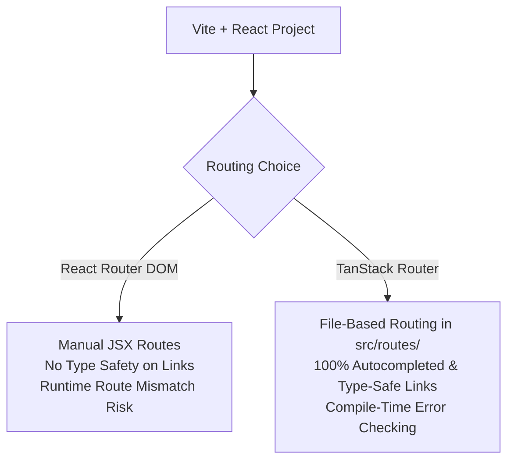

# Lecture Guide: Modern Frontend Routing & UI Architecture
## From React Router DOM to TanStack Router, the DRY Principle & UI Feedback Fundamentals

**Course:** IT Elective 2 — Website Application Development (Frontend Framework)  
**Topic:** Routing Paradigms, Type-Safe File-Based Routing, Typed Constants, and Accessible UI Feedback  

---

## 🎯 Today's Learning Objectives

By the end of this lecture, students will be able to:
1. **Compare Traditional & Modern Routing**: Explain how `react-router-dom` handles routes manually via JSX and why modern React apps are transitioning to type-safe, file-based routing with **TanStack Router**.
2. **Configure TanStack Router in Vite**: Install required packages, configure the Vite router plugin, set up path aliases (`@/`), and boot the router engine in `main.tsx`.
3. **Build File-Based Routes & Layouts**: Create root layouts (`__root.tsx`), page routes (`index.tsx`, `about.tsx`), dynamic route parameters (`$studentId`), and navigate using `<Link>` with active states.
4. **Apply the DRY Principle**: Centralize reusable UI text and messages using a typed TypeScript constant file (`as const`) to enforce compile-time autocomplete and zero typos.
5. **Implement UI Feedback Patterns**: Construct interactive loading/disabled button states and an accessible, auto-dismissing Toast notification component (`role="status"`).

---

## SECTION I. TRADITIONAL ROUTING WITH REACT ROUTER DOM (The Classic Approach)

### 1.1 What is Client-Side Routing?
In single-page applications (SPAs), the browser downloads one `index.html` file. Instead of making full HTTP requests to a server every time a user clicks a menu item, client-side routing intercepts URL changes in JavaScript and conditionally renders components based on the path.

### 1.2 The General/Traditional Standard: `react-router-dom`
If you have looked up React routing tutorials online over the last decade, **React Router DOM (`react-router-dom`)** is the package you most likely encountered. It has been the industry standard for client-side routing since the early days of React.

#### How `react-router-dom` Works (JSX Route Tree Configuration)
In a traditional setup, you manually define a central route configuration inside `App.tsx` using JSX elements:

```tsx
// Traditional approach using react-router-dom inside App.tsx
import { BrowserRouter, Routes, Route, Link, useParams } from "react-router-dom";

function App() {
  return (
    <BrowserRouter>
      {/* Shared Navigation Header */}
      <nav className="flex gap-4 p-4 border-b">
        <Link to="/">Home</Link>
        <Link to="/about">About</Link>
        <Link to="/students/42">Student Profile</Link>
      </nav>

      {/* Manual Route Definition Tree */}
      <Routes>
        <Route path="/" element={<HomePage />} />
        <Route path="/about" element={<AboutPage />} />
        <Route path="/students/:studentId" element={<StudentDetailPage />} />
        <Route path="*" element={<NotFoundPage />} />
      </Routes>
    </BrowserRouter>
  );
}

function StudentDetailPage() {
  // Un-typed parameter extraction
  const { studentId } = useParams();
  return <h1>Student ID: {studentId}</h1>;
}
```

### 1.3 Key Characteristics & Limitations of `react-router-dom`

| Feature | React Router DOM (Classic) | Why Modern Teams Seek Alternatives |
| :--- | :--- | :--- |
| **Route Definitions** | Manually written in JSX inside `App.tsx` or a `routes.tsx` array. | Central route configuration files get bloated and hard to maintain as projects grow. |
| **Type Safety** | Non-existent out-of-the-box. `<Link to="/aboot">` is valid TS code. | Typos in path strings pass compilation silently and break at runtime with broken pages or 404s. |
| **URL Parameters** | Extracted via `useParams()` returning `Record<string, string \| undefined>`. | You must manually cast or check param types (e.g. converting `studentId` from `string` to `number`). |
| **Project Focus** | Shifted primary focus toward Remix / full-stack frameworks (React Router v7). | Pure client-side SPAs built with Vite benefit from lightweight, dedicated client-side routers. |

> [!NOTE]
> **Instructor Note to Class**: "React Router DOM is still everywhere in existing codebases, and understanding its manual JSX configuration is essential. However, in modern enterprise React development—especially when using TypeScript—we want the compiler to catch broken links before our app ever hits production."

---

## SECTION II. GETTING STARTED WITH TANSTACK ROUTER (The Modern Approach)

### 2.1 Why Switch from React Router to TanStack Router?

**TanStack Router** is a ground-up redesign of client-side routing tailored for Vite, React, and TypeScript.



#### The Four Core Advantages:
1. **Type-Safe by Design**: Every `<Link to="...">` and route parameter is verified by TypeScript at compile time. If you mistype a route, your project **will not build**.
2. **File-Based Routing**: Folder structure inside `src/routes/` automatically defines URL routes—no manual route lists to edit by hand.
3. **Built for Client-Side SPAs**: Purpose-built for modern Vite + React applications.
4. **Automatic Code Splitting**: Integrates with Vite to automatically split each page into its own JavaScript bundle chunk for maximum speed.

---

### 2.2 Installing the Packages

Run this terminal command inside your project folder (`my-app` scaffolded with Vite + React + TypeScript):

```bash
# Core router engine and interactive devtools
pnpm add @tanstack/react-router @tanstack/react-router-devtools

# Vite plugin for automatic route generation
pnpm add -D @tanstack/router-plugin
```

---

### 2.3 Wiring Up the Vite Plugin

TanStack Router uses a Vite plugin to monitor `src/routes/` and automatically generate your route tree index.

Update [`vite.config.ts`](file:///vite.config.ts):

```typescript
import path from "node:path";
import react from "@vitejs/plugin-react";
import { defineConfig } from "vite";
import tailwindcss from "@tailwindcss/vite";
import { tanstackRouter } from "@tanstack/router-plugin/vite";

export default defineConfig({
  plugins: [
    // CRITICAL: tanstackRouter MUST come BEFORE react()
    tanstackRouter({ 
      target: "react", 
      autoCodeSplitting: true 
    }),
    react(),
    tailwindcss(),
  ],
  resolve: {
    alias: {
      "@": path.resolve(import.meta.dirname, "./src"),
    },
  },
});
```

> [!IMPORTANT]
> **Plugin Order Rule**: `tanstackRouter()` **must** be listed before `react()` inside `plugins: []`.  
> When you run `pnpm dev`, a file named `src/routeTree.gen.ts` is automatically generated. **Never edit `routeTree.gen.ts` manually.**

---

### 2.4 Adding Path Alias (`@/`) Configuration

To avoid deeply nested relative paths like `../../components/Button`, set up an `@/` path alias pointing to `src/`.

#### Step A — Update [`tsconfig.app.json`](file:///tsconfig.app.json)
Add `baseUrl` and `paths` inside `compilerOptions`:

```json
{
  "compilerOptions": {
    "baseUrl": ".",
    "paths": {
      "@/*": ["./src/*"]
    }
  }
}
```

#### Step B — Verify [`vite.config.ts`](file:///vite.config.ts)
Ensure the `resolve.alias` section is configured (as shown in section 2.3 above).

> [!TIP]
> TypeScript handles IDE autocomplete using `tsconfig.app.json`, while Vite handles actual module resolution at build time via `vite.config.ts`. Both must match! Restart `pnpm dev` after editing these config files.

---

### 2.5 Booting the Router in `src/main.tsx`

Instead of rendering `<App />`, we now pass a configured `<RouterProvider>` to React's DOM root.

Update [`src/main.tsx`](file:///src/main.tsx):

```tsx
import { StrictMode } from "react";
import { createRoot } from "react-dom/client";
import { RouterProvider, createRouter } from "@tanstack/react-router";
import { routeTree } from "./routeTree.gen";
import "./index.css";

// Build the router instance from generated route tree
const router = createRouter({ routeTree });

// Register router module for global type inference across your app
declare module "@tanstack/react-router" {
  interface Register {
    router: typeof router;
  }
}

createRoot(document.getElementById("root")!).render(
  <StrictMode>
    <RouterProvider router={router} />
  </StrictMode>,
);
```

---

### 2.6 The `src/routes/` Folder Conventions

Create the directory `src/routes/`. File naming rules automatically govern URL paths:

| File Location | Corresponding URL | Purpose |
| :--- | :--- | :--- |
| `src/routes/__root.tsx` | N/A (Shared Shell) | The master layout wrapping all pages (navbar, footer). |
| `src/routes/index.tsx` | `/` | The homepage route. |
| `src/routes/about.tsx` | `/about` | The about page route. |
| `src/routes/students.$studentId.tsx` | `/students/42` | Dynamic segment (`$studentId` captures path parameters). |

---

### 2.7 Building the Shared Root Layout (`__root.tsx`)

Create [`src/routes/__root.tsx`](file:///src/routes/__root.tsx):

```tsx
import { createRootRoute, Link, Outlet } from "@tanstack/react-router";

export const Route = createRootRoute({
  component: RootLayout,
});

function RootLayout() {
  return (
    <>
      <nav className="flex gap-4 border-b border-gray-200 p-4">
        <Link
          to="/"
          activeProps={{ className: "font-bold text-emerald-700" }}
          className="hover:underline"
        >
          Home
        </Link>
        <Link
          to="/about"
          activeProps={{ className: "font-bold text-emerald-700" }}
          className="hover:underline"
        >
          About
        </Link>
      </nav>
      
      {/* Active route component renders inside <Outlet /> */}
      <main className="p-6">
        <Outlet />
      </main>
    </>
  );
}
```

> [!NOTE]
> - `<Outlet />`: Serves as the placeholder where the matched page component is injected.
> - `activeProps`: Automatically applies classes when the current URL matches the link target.

---

### 2.8 Defining Page Routes

#### Homepage Route ([`src/routes/index.tsx`](file:///src/routes/index.tsx))

```tsx
import { createFileRoute } from "@tanstack/react-router";

export const Route = createFileRoute("/")({
  component: Home,
});

function Home() {
  return <h1 className="text-2xl font-bold">Welcome Home</h1>;
}
```

#### About Page Route ([`src/routes/about.tsx`](file:///src/routes/about.tsx))

```tsx
import { createFileRoute } from "@tanstack/react-router";

export const Route = createFileRoute("/about")({
  component: About,
});

function About() {
  return <p>This is the About page.</p>;
}
```

---

### 2.9 Navigation: `<Link>` vs Standard HTML `<a>` Tags

```tsx
// BAD: Reloads whole application, resets React state completely
<a href="/about">About</a>

// GOOD: Intercepts click, updates URL, swaps components client-side instantly
<Link to="/about">About</Link>
```

### 2.10 Project Clean-Up
With routing managing our page components, obsolete starter files should be removed:
- Delete `src/App.tsx`
- Delete `src/App.css`
- Delete `src/Test.tsx`

---

## SECTION III. THE DRY PRINCIPLE (DON'T REPEAT YOURSELF)

### 3.1 What is DRY?
**DRY (Don't Repeat Yourself)** dictates that every piece of knowledge, label, or rule in a codebase should exist in **exactly one place**.

### 3.2 The Problem: Hardcoded Strings Across Files

Imagine showing a simple confirmation message across multiple components:

```tsx
// SaveButton.tsx
alert("Saved successfully!");

// ProfileForm.tsx
<p>Saved successfully!</p>

// SettingsPage.tsx
toast("Saved successfully!");
```

If your instructor or client requests changing this wording to `"Changes saved!"`, you must hunt down every hardcoded occurrence. Missing even one creates UI inconsistencies.

---

### 3.3 Technique 1 vs Technique 2 Comparison

```carousel
#### Technique 1: JSON File (`src/constants/common.json`)
```json
{
  "toast": {
    "success": "Saved successfully!",
    "error": "Something went wrong. Please try again."
  },
  "button": {
    "loading": "Saving...",
    "submit": "Submit"
  }
}
```

*Usage:* `import common from "@/constants/common.json";`  
*Drawback:* TypeScript doesn't validate typos like `common.taost.success` unless extra TS options (`resolveJsonModule`) are tweaked.

<!-- slide -->

#### Technique 2: Typed TS Constants File (`src/constants/messages.ts`) — COURSE STANDARD
```typescript
export const MESSAGES = {
  toast: {
    success: "Saved successfully!",
    error: "Something went wrong. Please try again.",
  },
  button: {
    loading: "Saving...",
    submit: "Submit",
  },
} as const;
```

*Usage:* `import { MESSAGES } from "@/constants/messages";`  
*Benefit:* Autocomplete in editor + instant red squiggle compiler errors on typos like `MESSAGES.toast.succes`.
```

> [!TIP]
> The `as const` assertion locks down the JavaScript object literal into read-only literal types, enabling TypeScript's exact string autocomplete and type checking.

---

## SECTION IV. UI FEEDBACK FUNDAMENTALS

### 4.1 Why User Feedback Matters
A web interface must communicate state transitions clearly to the user:
1. **Did my click register?** (Active / hover visual cues)
2. **Is work happening right now?** (Loading state + disabled interactions)
3. **Did the action succeed or fail?** (Toast notifications)

---

### 4.2 Building Button States (Loading, Disabled, Hover)

```tsx
import { useState } from "react";
import { MESSAGES } from "@/constants/messages";

function SaveButton() {
  const [isLoading, setIsLoading] = useState(false);

  const handleClick = () => {
    setIsLoading(true);
    setTimeout(() => setIsLoading(false), 1500);
  };

  return (
    <button
      type="button"
      disabled={isLoading}
      onClick={handleClick}
      className="rounded-md bg-emerald-600 px-4 py-2 text-white transition-colors
                 hover:bg-emerald-700
                 disabled:cursor-not-allowed disabled:bg-emerald-300"
    >
      {isLoading ? MESSAGES.button.loading : MESSAGES.button.submit}
    </button>
  );
}
```

---

### 4.3 Building a Reusable Toast Component

Create [`src/components/Toast.tsx`](file:///src/components/Toast.tsx):

```tsx
import { useEffect } from "react";
import { MESSAGES } from "@/constants/messages";

type ToastType = "success" | "error";

interface ToastProps {
  type: ToastType;
  onClose: () => void;
}

function Toast({ type, onClose }: ToastProps) {
  // Auto-dismiss after 3 seconds
  useEffect(() => {
    const timer = setTimeout(onClose, 3000);
    return () => clearTimeout(timer); // Timer cleanup prevents memory leaks
  }, [onClose]);

  const message =
    type === "success" ? MESSAGES.toast.success : MESSAGES.toast.error;

  const colorClasses =
    type === "success"
      ? "bg-emerald-600 border-emerald-700"
      : "bg-red-600 border-red-700";

  return (
    <div 
      role="status" 
      className={`fixed bottom-4 right-4 rounded-md border px-4 py-3 text-white shadow-lg ${colorClasses}`}
    >
      {message}
    </div>
  );
}

export default Toast;
```

---

### 4.4 Complete Assembled Home Route

Update [`src/routes/index.tsx`](file:///src/routes/index.tsx):

```tsx
import { useState } from "react";
import { createFileRoute } from "@tanstack/react-router";
import { MESSAGES } from "@/constants/messages";
import Toast from "@/components/Toast";

export const Route = createFileRoute("/")({
  component: Home,
});

function Home() {
  const [isLoading, setIsLoading] = useState(false);
  const [toastType, setToastType] = useState<"success" | "error" | null>(null);

  const handleSave = () => {
    setIsLoading(true);
    setTimeout(() => {
      setIsLoading(false);
      setToastType("success");
    }, 1500);
  };

  return (
    <div className="space-y-4">
      <h1 className="text-2xl font-bold">Welcome Home</h1>
      
      <button
        type="button"
        disabled={isLoading}
        onClick={handleSave}
        className="rounded-md bg-emerald-600 px-4 py-2 text-white transition-colors
                   hover:bg-emerald-700
                   disabled:cursor-not-allowed disabled:bg-emerald-300"
      >
        {isLoading ? MESSAGES.button.loading : MESSAGES.button.submit}
      </button>

      {toastType && (
        <Toast type={toastType} onClose={() => setToastType(null)} />
      )}
    </div>
  );
}
```

---

## SECTION V. QUICK REFERENCE & SUMMARY

### New Files Created in This Lecture
- [`src/routes/__root.tsx`](file:///src/routes/__root.tsx) — Root layout with shell UI & `<Outlet />`.
- [`src/routes/index.tsx`](file:///src/routes/index.tsx) — Homepage view & UI feedback demo.
- [`src/routes/about.tsx`](file:///src/routes/about.tsx) — About page view.
- [`src/constants/messages.ts`](file:///src/constants/messages.ts) — Typed constants file using `as const`.
- [`src/components/Toast.tsx`](file:///src/components/Toast.tsx) — Reusable alert toast with `role="status"`.
- `src/routeTree.gen.ts` — Auto-generated router file (do not touch).

### Summary Table

| Concept | Key Takeaway |
| :--- | :--- |
| **React Router DOM** | Classic JSX-driven router; lacks compile-time link verification. |
| **TanStack Router** | Next-gen type-safe router; folder structure in `src/routes/` auto-generates routes. |
| **DRY Principle** | Store strings once in `messages.ts` using `as const` to get full autocomplete & zero typos. |
| **Controlled Feedback** | Pair `isLoading` and `toastType` state to disable buttons and auto-dismiss toasts cleanly. |

---

## 👩‍🏫 INSTRUCTOR LESSON PLAN & TIMING GUIDE

| Time | Segment | Key Discussion Points | Student Activity |
| :--- | :--- | :--- | :--- |
| **10 min** | **Part 1: React Router DOM** | Demonstrate traditional JSX route tree in `App.tsx`. Point out how mistyping `<Link to="/aboot">` compiles without errors. | Analyze legacy code sample; identify potential runtime typo bugs. |
| **15 min** | **Part 2: TanStack Setup** | Explain file-based routing and install `@tanstack/react-router` and `@tanstack/router-plugin`. Emphasize plugin ordering in `vite.config.ts`. | Run installation commands, update `vite.config.ts` and `tsconfig.app.json`. |
| **25 min** | **Part 3: Building Routes** | Live-code `__root.tsx`, `index.tsx`, and `about.tsx`. Show `routeTree.gen.ts` generating in real-time. | Create `src/routes/` directory and build their first file-based page components. |
| **15 min** | **Part 4: DRY Principle** | Contrast JSON config vs `messages.ts` with `as const`. Show editor autocomplete on `MESSAGES.`. | Refactor inline UI strings to use `MESSAGES`. |
| **25 min** | **Part 5: UI Feedback** | Code `Toast.tsx` with `useEffect` cleanup and accessible `role="status"`. Hook up `isLoading` state. | Assemble button loading states and toast notifications on homepage. |
